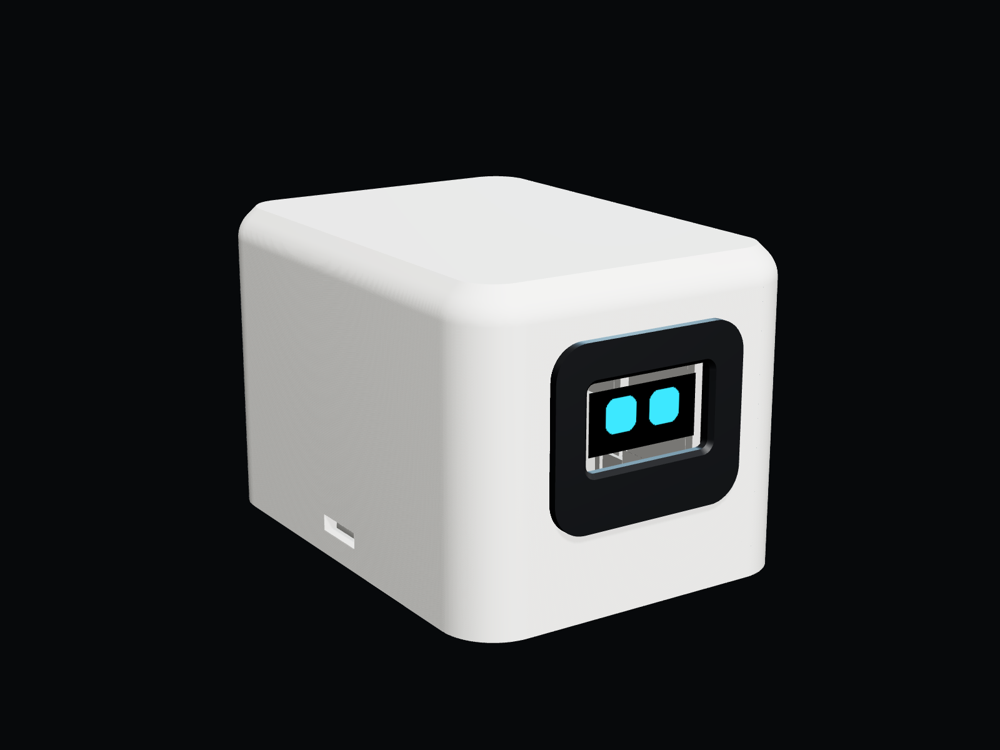
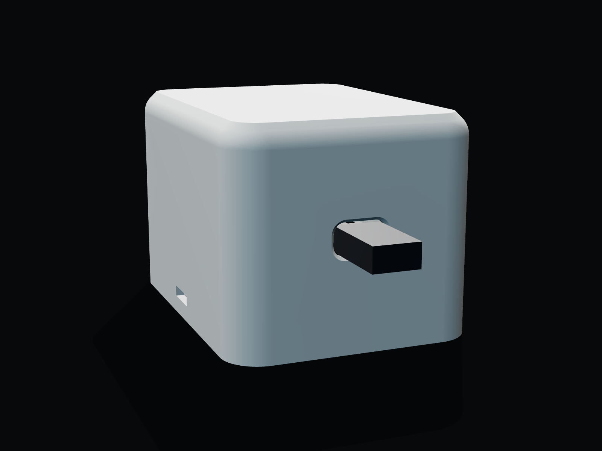
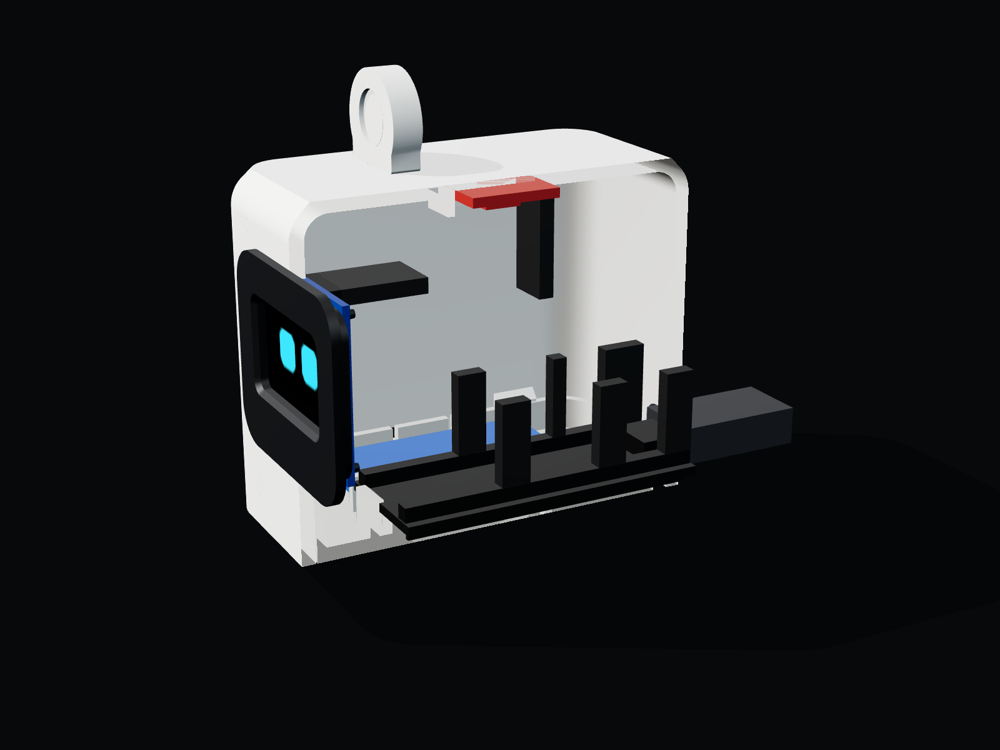
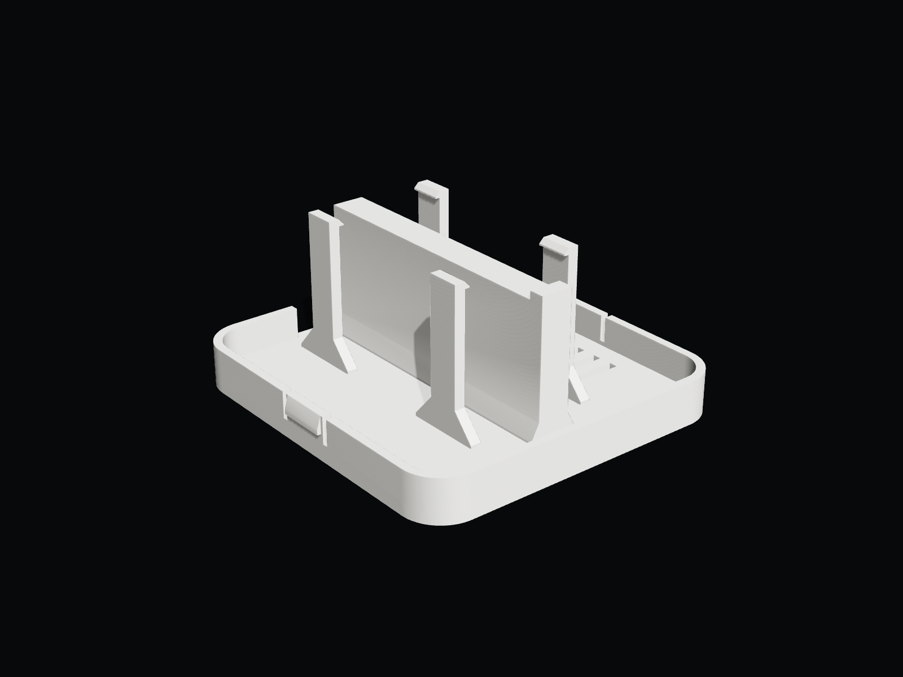
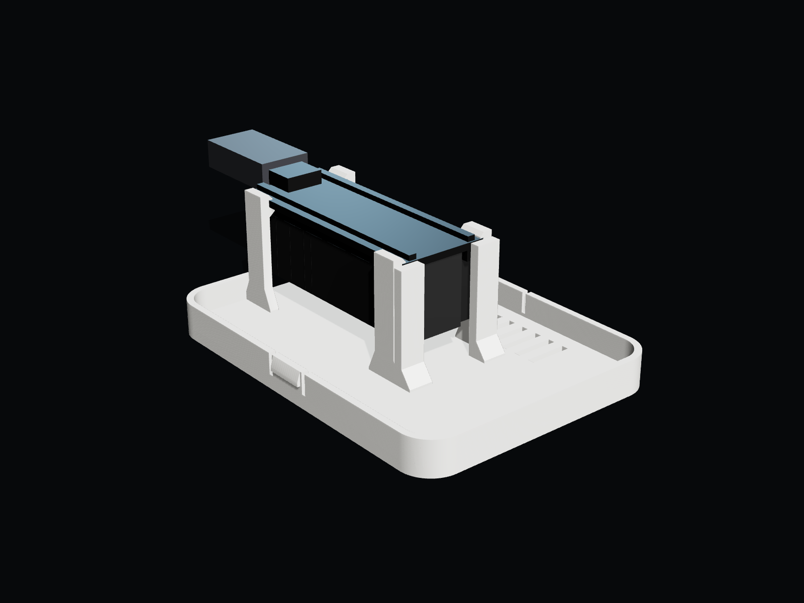
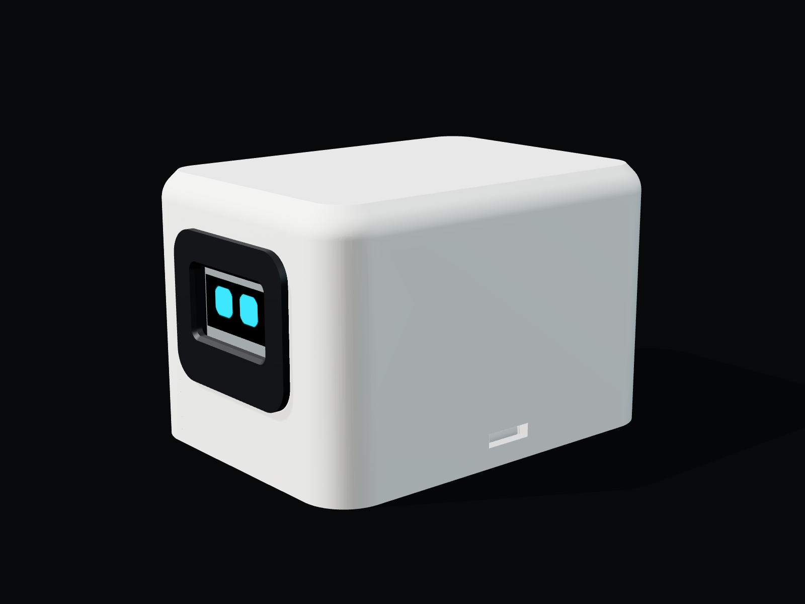
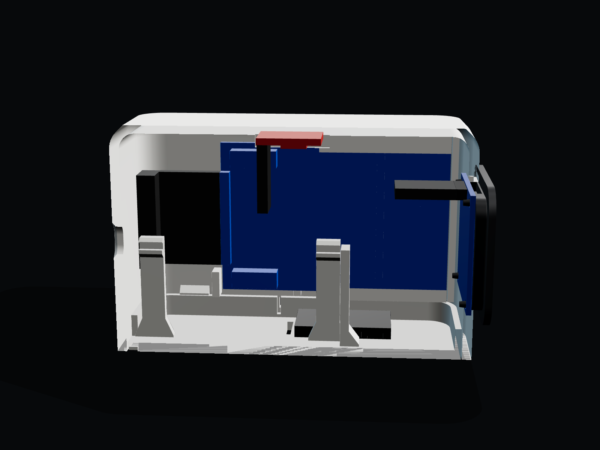
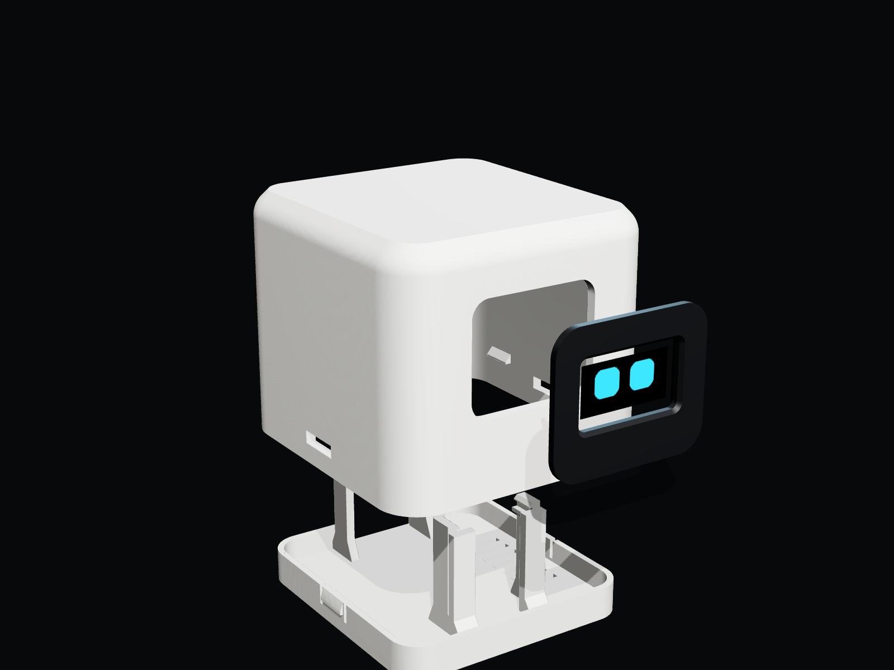

# The enclosure

A head for the face: a soft cube, the screen behind a black visor, the Black Pill up on a stand inside, a touch pad under the top so you pet it where you'd pet a pet, and the RFID reader hidden inside its right side, so you tap your card on its cheek. Nothing on the outside gives it away.



|  |  |
| --- | --- |
| The USB-C port in the back, lined up with the Black Pill's connector | Inside: the screen behind the visor, the Black Pill on its stand with its jumper plugs hanging underneath, the touch pad under the top |

|  |  |
| --- | --- |
| The base: four posts that hold the Black Pill by its edges, the front two wrapping round its corners | The board on them, chip side up, its plugs and the SWD header hanging free underneath |

|  |  |
| --- | --- |
| The right side: smooth, the reader behind it. Tap the card near the front half | Inside the right wall: the RC522 in its holder, antenna end at the front, its plugs toward the back |



**66 × 89.5 × 58 mm.** It was 70 mm deep until the RFID reader went in: the RC522 is 60 mm long, its jumper plugs carry on 16 mm past its end, and the wires need a few more to turn, all between the head's round corners. The depth is worked out from those numbers in `model.py`, not typed in. Everything is modelled in [`model.py`](model.py) from the WeAct board drawing and the OLED module's dimensions, and [`check.py`](check.py) fits it all together with stand-ins for the boards, a jumper plug on every one of the Black Pill's 40 pins, the SWD header (straight with a plug on it, or right-angle), a USB-C plug pushed fully home, and the RC522 with its plugs and crystal (either way up): nothing overlaps.

## The Black Pill's stand

The Black Pill goes in the way it's wired: chip, buttons and USB-C on top, headers pointing down, every jumper plug hanging underneath, and the 4-pin SWD header on that side too, in the middle of the far end. So it sits 23.5 mm up, held only by its edges:

- **Four springy posts** stand outside the rows of plugs. Each has a ledge under the board's edge, in the 1.5 mm strip between the edge and the yellow header strip, and a clip over its top, so the board can't lift, drop or slide sideways.
- **The two front posts wrap round the board's corners.** They take the push when the USB cable goes in, and the back wall takes the pull when it comes out. Between them the far end is open, so the SWD header, and a plug on it if you ever want one, hangs free.
- **Nothing sits under the board.** The whole space between the two header strips is empty, down to the floor. The plugs end 7 mm above the floor, which leaves room for the wires to bend out to the sides.

Nothing reaches over the board's top except those four clips, so the buttons and the USB-C stay clear.

## The RFID reader's holder

The RC522 stands inside the right wall, long side front to back, its component side facing in. A card tapped on the outside reads through about 6 mm: the 2.4 mm wall, a 2 mm gap, and the board. There's no mark on the outside on purpose, since the card opens a hidden folder: the antenna is behind the front half of the side, about halfway up.

- **It hangs, it isn't screwed.** Its top edge sits in a slot under the roof, its bottom edge in a groove whose inner side slopes at 45°. To fit it, tilt it, push its top up into the slot (there's 2 mm to spare), swing the bottom in past the groove's edge and let it drop. A bit of tape behind it if you want it to never rattle.
- **The groove and the slot only grip the antenna end.** The crystal and the header sit at the other end, close to the edges, so nothing reaches over them.
- **Two ribs behind it and a stop at each end** keep it 2 mm off the wall, clear of the header's solder stubs, and stop it sliding.
- **It goes either way up.** Its header is off centre, so pick whichever way leaves the plugs easiest to reach.

## What to print

The STL files are already turned the way they go on the bed. **No supports** on any of them.

| Part | File | On the bed | Colour | Time* |
| --- | --- | --- | --- | --- |
| Head | [`stl/shell.stl`](stl/shell.stl) | Upside down, top on the bed | Any (white in the renders) | ~3.5 h |
| Visor | [`stl/visor.stl`](stl/visor.stl) | Face down | **Black**, so only the lit pixels show | ~15 min |
| Base | [`stl/base.stl`](stl/base.stl) | Flat | Any | ~1.5 h |

\*Rough, at 0.2 mm layers.

PLA or PETG, 0.4 mm nozzle, 0.2 mm layers, 15% infill. The walls are 2.4 mm, six lines, so they print solid anyway. The head's top edge is rounded where it shows and turns into a 45° chamfer where it meets the bed, so the first layers don't droop.

## What else you need

- **A TTP223 touch sensor module** (the small 15 × 11 mm one). It sits under the thinned top and senses your finger through 1 mm of plastic. For the bigger 24 × 24 mm round one, set `TOUCH_L` and `TOUCH_W` to 24 in `model.py`.
- **3 more jumper wires** for it.
- **The RC522** with its plugs on, wired as in the main README.
- A drop of superglue (or a soldering iron) for the visor's four pegs.
- The new firmware, which reads the touch pad on **B0** (upload it as usual; with the base out, KEY and NRST are right there on top of the board).

## Putting it together

1. **Print the visor first** and check the screen before printing anything else. Press the OLED onto its four pegs, glass into the recess, then power the pet and double tap to the **Status** screen. The whole top line (*Desktop pet … USB*) and bottom line (*Up …*) should show through the window. If a line is cut off, measure roughly how far and change `AA_UP` in `model.py` (positive moves the window up). Then take the OLED off again.
2. **Screen into the head.** Push the visor into the face from the outside. Reach in through the open bottom, put the OLED onto the pegs and glue or melt each peg tip. The screen is now clamped through the wall and can't move.
3. **The RFID reader into the right wall,** component side facing in, antenna end toward the face, plugs already on and pointing back. Tilt it, top edge up into the slot first, swing the bottom in and let it drop into the groove.
4. **Touch pad under the top.** Pad side up (the side without the chip), pins toward the back, into the pocket in the middle of the top. A bit of tape or glue holds it. Don't touch the head while the pet powers up: the TTP223 measures its "not touched" level then.
5. **Black Pill onto its stand,** with its jumpers already plugged in. USB end toward the back of the base (the end with the finger notch), chip side up, its far end against the two corner stops. Press it down between the four posts until all four clips snap over its edges. Bend the wires out to the sides under the board.
6. **The ESP-01** goes loose on the floor, on the right, over the vents.
7. **Wire everything** as in the main README, and the touch pad as below.
8. **Base into the head,** USB end at the back, until both catches click into the side windows. To open it again, press both catches in through those windows and pull the base down by the notch at the back.

### The touch pad's wiring

| TTP223 | Black Pill |
| --- | --- |
| VCC | B14 (the pet powers it from a pin: it draws microamps) |
| GND | B15 |
| I/O | B0 |

Touching it does everything KEY does: tap to pet, three taps for hearts, double tap for the next screen, hold to go back. KEY still works too. The pad isn't on KEY's own pin (A0), because the bootloader reads A0 at every reset, and a TTP223 holds its output low while nobody's touching it.

## Changing it

All the numbers are at the top of [`model.py`](model.py): the head's size and radii, the wall thickness, the clearance between parts (`FIT`), the OLED's hole spacing and the window, how high the Black Pill sits (`BP_LIFT`), the USB-C port, the touch pad, and the RFID reader (`RFID_*`, which also sets the depth).

```bash
pip install manifold3d trimesh numpy scipy
python model.py      # the STLs, into stl/
python check.py      # fits everything together and lists any overlap, writes assembly.glb
node render.mjs      # the pictures, into renders/ (uses headless Chrome)
```
